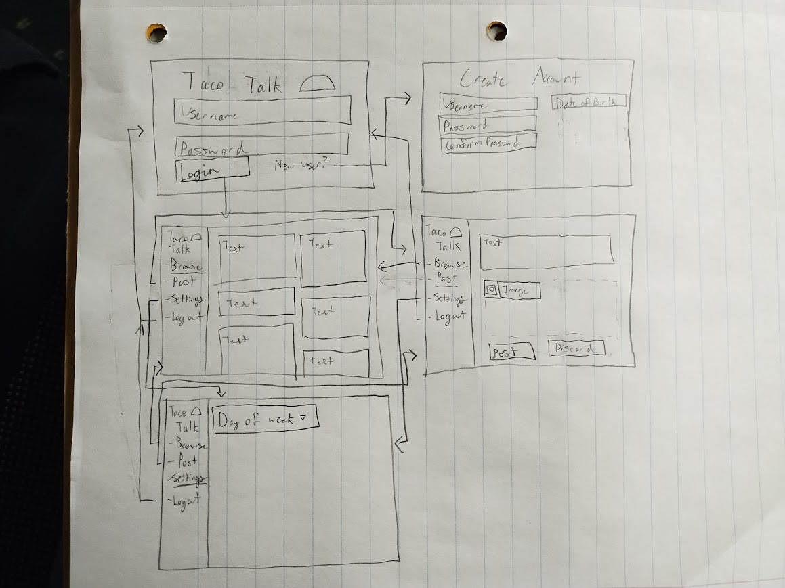

# Taco Talk
### Elevator Pitch
Do you have a social media addiction? Try out Taco Talk, the social media that only works on Tuesdays! (Or whatever day you set for yourself in the settings). Using Taco Talk, you can still communicate with your friends while limiting the amount of time that you waste. You can comment on friend's pages and post things to your own. Taco Talk is *the* social media for talking with friends whilst still curbing your social media addiction. 

### Design

### Key Features
+ Secure HTTPS login
+ Ability to post text that will be permanently stored
+ Ability to view other people's posts
+ Ability to comment on other people's posts
+ A Settings page to change the day of the week that you want to use Taco Talk
+ Notifications for people replying to your post
+ Save draft posts
If time permits...
+ Ability to upload images
+ More settings on the settings page like themes
+ Friending and friend requests

### Technologies
+ HTML - Properly structures application.  Access all five webpages of the website. Logo image
+ CSS - Makes the webpages look good. Coloring, spacing, looks good on different screens, etc. 
+ JavaScript - Makes login work. Making posts. Changing settings
+ Service - Obtain other people's posts, validate login credentials
+ DB/Login - Create login, keep login credentials, assign login name to posts, and remember settings
+ WebSocket - People's posts are made immediately visible to other
+ React - Application ported to use the React web framework.

### HTML deliverable

For this deliverable I built out the structure of my application using HTML.

+ HTML - Five HTML pages for logging in, signing up, browsing posts, posting posts, and a settings page. 
+ Links - The login page and the sign-up page link to each other, while the login page, browse page, settings page, and index page all have a nav tag with links to each other. 
+ Text - All posts will have a text description given by the user that posted it. For now, it is just placeholder text. Additionally,there are labels for all of the settings and inputs. 
+ Images - Included logo images on every page and a placeholder image in browse. There are also tooltip images, which utilize the image title feature to provide more information about related settings. 
+ Login - Input box and submit button for login along with a separate sign up page. 
+ Database - Username, password, and associated settings choices will be stored in the database along with posts people have made.
+ WebSocket - Posts that people browse will be updated in real time. 

### CSS deliverable

For this deliverable I properly styled the application into its final appearance.

+ Header, footer, and main content body styled with flex.
+ Navigation elements - Turn green when hovered over, can get to every website. Navigation displayed prominently in the sidebar. 
+ Responsive to window resizing - My website looks good for most sizes, but for really thin screens it starts to fall apart.
+ Application elements - The website has good contrast and whitespace.
+ Application text content - The fonts are consistent.
+ Application images - Has images that fit properly into the website. 